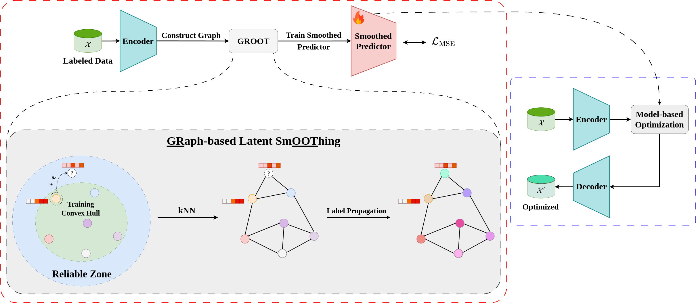

<div align="center">

# GROOT: Effective Design of Biological Sequences with Limited Experimental Data
</div>

## Table of Contents:

- [Introduction](#introduction)
- [Dependencies](#dependencies)
- [Installation](#installation)
    - [Setup benchmarks](#setup-benchmarks)
    - [Download pretrained weights](#download-pretrained-weights)
- [Usage](#usage)
    - [Training](#training)
    - [Optimization](#optimization)

## Introduction
This is the official implementation of the manuscript "GROOT: Effective Design of Biological Sequences with Limited Experimental Data".



## Dependencies
The [`environment.yaml`](environment.yml) file conains the necessary dependencies to run GROOT. It requires Python 3.10, CUDA version 11.8 to run the main pipeline.

## Installation

Follow these steps to install GROOT:

```shell
conda env create -f environment.yml
conda activate groot
pip install pyg_lib torch_scatter torch_sparse torch_cluster torch_spline_conv -f https://data.pyg.org/whl/torch-2.1.0+cu118.html
pip install -e .
```

Please setup [wandb](https://wandb.ai/) to train VAE model with logging utilities. Otherwise, you can disable it by prepending `WANDB_DISABLED=true` before running python script.

### Setup benchmarks
The checkpoints of oracles provided by [GGS](https://github.com/kirjner/GGS) are already included in the repository, under the directory [`ckpts`](./ckpts/).

The benchmark datasets are provided in [`data`](./data/) directory. Otherwise, you can generate your own sub-dataset by spliting the ground-truth with script [`split_data.py`](./scripts/split_data.py).

### Download pretrained weights
We provide the pretrained VAE model for AAV and GFP dataset [here](https://drive.google.com/drive/folders/1NdrmB4NgG-V5mIv_JMJyw_pln2M9N7VD?usp=sharing).

## Usage

### Training

To train VAE model for each benchmark dataset, run script [`train_vae.py`](./scripts/train_vae.py) as follows:

```shell
python scripts/train_vae.py [CONFIG_FILE] --csv_file [CSV_FILE] --devices [DEVICES] --output_dir [OUTPUT_DIR] --dataset [DATASET]
```

| Parameter | Type | Description | Options | Required | Default |
|--|--|--|--|--|--|
|`config_file`|str|Path to config module||✔️||
|`output_dir`|str|Path to output directory||✔️||
|`csv_file`|str|Path to training data||✔️||
|`dataset`|str|Training dataset|AAV, GFP|✔️||
|`expected_kl`|float|Expected KL-Divergence value|||40|
|`batch_size`|int|Batch size|||64|
|`devices`|str|Training devices separated by comma|||-1|
|`ckpt_path`|str|Path to checkpoint to resume training|||None|
|`wandb_id`|str|WandB experimental id to resume|||None|
|`prefix`|str|Prefix to add to checkpoint file|||""|

You can use the configuration templates in [`vae`](./scripts/configs/vae/) directory. Checkpoints will be saved in `[OUTPUT_DIR]/vae_ckpts/` folder.

### Optimization

To perform optimization, run script [`optimize.py`](./scripts/optimize.py) as follows:

```shell
python scripts/optimize.py [CONFIG_FILE] --devices [DEVICES] --dataset [DATASET] --model_ckpt_path [VAE_CKPT_PATH] --optim_config_path [OPTIM_CONFIG_PATH] --level [LEVEL] --output_dir [OUTPUT_DIR]
```

| Parameter | Type | Description | Options | Required | Default |
|--|--|--|--|--|--|
|`config_file`|str|Path to config module||✔️||
|`model_ckpt_path`|str|Path to VAE checkpoint||✔️||
|`dataset`|str|Training dataset|AAV, GFP|✔️||
|`level`|str|Benchmark difficulty|easy, medium, hard, harder1, harder2, harder3|✔️||
|`optim_config_path`|str|Path to optimization configuration file||✔️||
|`output_dir`|str|Path to output directory||✔️||
|`batch_size`|int|Batch size|||128|
|`devices`|str|Training devices separated by comma|||-1|
|`changes`|list[str]|List of modifications made to replace argument in `optim_config_file`|||[]|

For more details about these arguments, refer to the [`optimize.sh`](./scripts/optimize.sh) file.

### Citation
If our paper or codebase help you with your research, please consider citing us:
```bibtex
@misc{tran2024grooteffectivedesignbiological,
      title={GROOT: Effective Design of Biological Sequences with Limited Experimental Data}, 
      author={Thanh V. T. Tran and Nhat Khang Ngo and Viet Anh Nguyen and Truong Son Hy},
      year={2024},
      eprint={2411.11265},
      archivePrefix={arXiv},
      primaryClass={cs.LG},
      url={https://arxiv.org/abs/2411.11265}, 
}
```